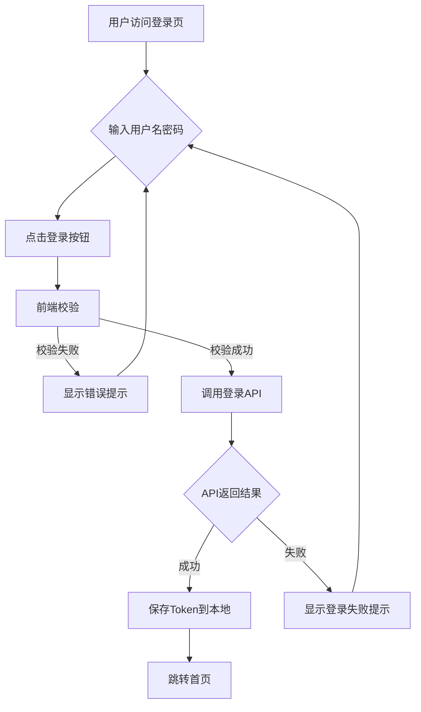
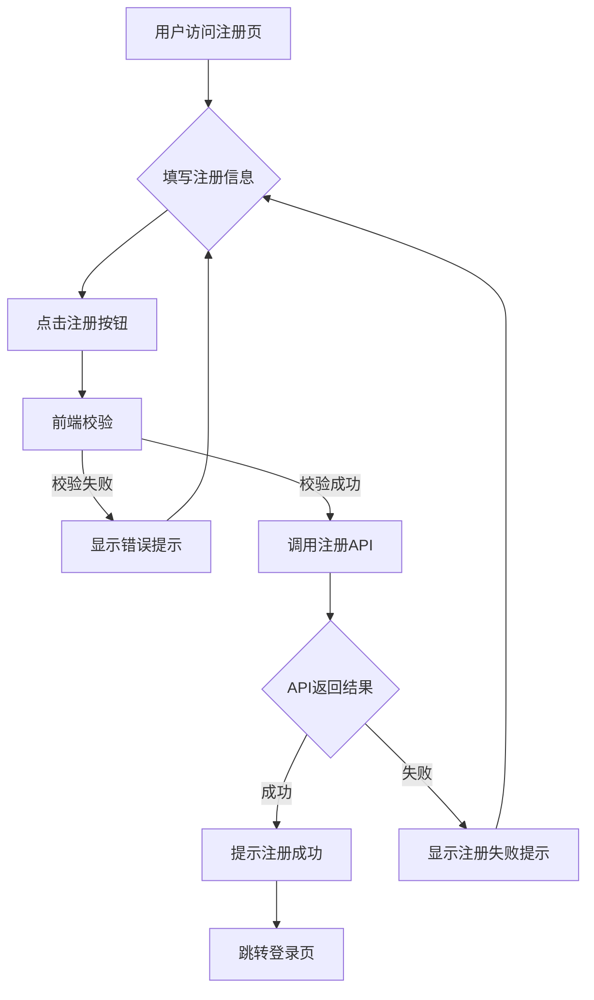

# 问诊用户用户名密码登录功能 - PRD文档

## 1. 文档信息

| 项目 | 内容 |
| :--- | :--- |
| **文档版本** | V1.0 |
| **创建日期** | 2026-05-10 |
| **最后更新** | 2026-05-10 |
| **作者** | 产品团队 |
| **状态** | 待评审 |
| **所属项目** | QA Live Healthcare Interview |

---

## 2. 需求背景

### 2.1 业务背景
当前系统已实现医生数据的MySQL存储和前后端联调，医生列表页面可正常显示数据。为完善问诊平台的用户体系，需要为问诊用户（患者）提供用户名密码登录功能，实现用户身份认证和系统访问控制。

### 2.2 需求来源
- 业务需求：患者需要登录系统才能进行在线问诊
- 安全需求：保护用户隐私和问诊数据安全
- 功能需求：支持用户名密码方式登录

### 2.3 目标用户
- **主要用户**：问诊患者（普通用户）
- **次要用户**：系统管理员

---

## 3. 功能需求

### 3.1 核心功能

| 功能编号 | 功能名称 | 需求描述 | 优先级 |
| :--- | :--- | :--- | :--- |
| FR-001 | 用户登录 | 支持用户名密码登录，验证用户身份 | 高 |
| FR-002 | 用户注册 | 支持新用户注册，创建账号 | 高 |
| FR-003 | 密码重置 | 支持忘记密码时通过邮箱/手机号重置 | 中 |
| FR-004 | 登录状态保持 | 支持记住登录状态（可选） | 中 |
| FR-005 | 登录失败处理 | 登录失败时显示友好提示，支持重试 | 高 |
| FR-006 | 会话管理 | 支持用户退出登录，清除会话 | 高 |

### 3.2 登录流程



### 3.3 注册流程



---

## 4. 非功能需求

### 4.1 性能需求

| 编号 | 需求描述 |
| :--- | :--- |
| PERF-001 | 登录请求响应时间 ≤ 200ms |
| PERF-002 | 登录页面加载时间 ≤ 1s |
| PERF-003 | 支持100+并发登录请求 |

### 4.2 安全需求

| 编号 | 需求描述 |
| :--- | :--- |
| SEC-001 | 密码传输必须使用HTTPS |
| SEC-002 | 密码存储使用BCrypt/SHA-256加密 |
| SEC-003 | 登录失败3次后限制登录（5分钟冷却） |
| SEC-004 | Token有效期设置为2小时 |
| SEC-005 | 支持Token刷新机制 |

### 4.3 兼容性需求

| 编号 | 需求描述 |
| :--- | :--- |
| COMP-001 | 支持Chrome 120+ |
| COMP-002 | 支持Safari 17+ |
| COMP-003 | 支持移动端响应式布局 |

---

## 5. 数据模型

### 5.1 用户实体（Patient/User）

| 字段名 | 类型 | 约束 | 说明 |
| :--- | :--- | :--- | :--- |
| id | VARCHAR(50) | PRIMARY KEY | 用户唯一标识 |
| username | VARCHAR(100) | NOT NULL, UNIQUE | 用户名（登录账号） |
| password | VARCHAR(255) | NOT NULL | 加密后的密码 |
| email | VARCHAR(200) | UNIQUE | 用户邮箱 |
| phone | VARCHAR(20) | UNIQUE | 用户手机号 |
| nickname | VARCHAR(100) | | 用户昵称 |
| avatar | TEXT | | 用户头像URL |
| status | INT | DEFAULT 1 | 用户状态（1-正常，0-禁用） |
| created_at | TIMESTAMP | DEFAULT CURRENT_TIMESTAMP | 创建时间 |
| updated_at | TIMESTAMP | DEFAULT CURRENT_TIMESTAMP ON UPDATE | 更新时间 |

### 5.2 登录请求DTO

| 字段名 | 类型 | 约束 | 说明 |
| :--- | :--- | :--- | :--- |
| username | String | NOT NULL | 用户名 |
| password | String | NOT NULL | 密码（明文） |
| rememberMe | Boolean | DEFAULT false | 是否记住登录 |

### 5.3 登录响应DTO

| 字段名 | 类型 | 说明 |
| :--- | :--- | :--- |
| success | Boolean | 是否成功 |
| message | String | 提示信息 |
| token | String | JWT Token |
| expiresAt | Long | Token过期时间戳 |
| user | UserInfo | 用户基本信息 |

### 5.4 用户信息DTO（UserInfo）

| 字段名 | 类型 | 说明 |
| :--- | :--- | :--- |
| id | String | 用户ID |
| username | String | 用户名 |
| nickname | String | 用户昵称 |
| avatar | String | 头像URL |
| email | String | 邮箱 |

---

## 6. UI/UX设计

### 6.1 登录页面设计

**页面布局：**
- 顶部：Logo + 系统名称
- 中部：登录表单（用户名输入框、密码输入框、登录按钮）
- 底部：注册链接、忘记密码链接

**表单元素：**

| 元素 | 类型 | 说明 |
| :--- | :--- | :--- |
| 用户名输入框 | input[type=text] | 支持邮箱/手机号/用户名登录 |
| 密码输入框 | input[type=password] | 支持显示/隐藏密码 |
| 记住我复选框 | checkbox | 可选，默认不勾选 |
| 登录按钮 | button | 主色调，点击触发登录 |
| 注册链接 | a标签 | 跳转注册页面 |
| 忘记密码链接 | a标签 | 跳转密码重置页面 |

**交互细节：**
- 输入框失焦时进行格式校验
- 密码框支持点击眼睛图标显示/隐藏密码
- 登录按钮在表单未填写完整时置灰
- 登录失败时显示红色错误提示

### 6.2 注册页面设计

**表单元素：**

| 元素 | 类型 | 说明 |
| :--- | :--- | :--- |
| 用户名输入框 | input[type=text] | 3-20位字母数字下划线 |
| 密码输入框 | input[type=password] | 6-20位，至少包含字母和数字 |
| 确认密码输入框 | input[type=password] | 必须与密码一致 |
| 邮箱输入框 | input[type=email] | 合法邮箱格式 |
| 手机号输入框 | input[type=tel] | 可选，11位手机号 |
| 昵称输入框 | input[type=text] | 可选，2-20位字符 |
| 注册按钮 | button | 主色调 |

---

## 7. 接口设计

### 7.1 登录接口

| 属性 | 值 |
| :--- | :--- |
| **路径** | `/api/auth/login` |
| **方法** | POST |
| **Content-Type** | application/json |

**请求体：**
```json
{
    "username": "string (必填，用户名/邮箱/手机号)",
    "password": "string (必填，密码)",
    "rememberMe": "boolean (可选，默认false)"
}
```

**成功响应（200）：**
```json
{
    "success": true,
    "message": "登录成功",
    "token": "eyJhbGciOiJIUzI1NiIsInR5cCI6IkpXVCJ9...",
    "expiresAt": 1715308800000,
    "user": {
        "id": "user001",
        "username": "testuser",
        "nickname": "测试用户",
        "avatar": "https://example.com/avatar.jpg",
        "email": "test@example.com"
    }
}
```

**失败响应（401）：**
```json
{
    "success": false,
    "message": "用户名或密码错误",
    "token": null,
    "user": null
}
```

### 7.2 注册接口

| 属性 | 值 |
| :--- | :--- |
| **路径** | `/api/auth/register` |
| **方法** | POST |
| **Content-Type** | application/json |

**请求体：**
```json
{
    "username": "string (必填，3-20位字母数字下划线)",
    "password": "string (必填，6-20位)",
    "confirmPassword": "string (必填，与密码一致)",
    "email": "string (必填，邮箱格式)",
    "phone": "string (可选，11位手机号)",
    "nickname": "string (可选，2-20位)"
}
```

**成功响应（201）：**
```json
{
    "success": true,
    "message": "注册成功",
    "userId": "user001"
}
```

**失败响应（400）：**
```json
{
    "success": false,
    "message": "用户名已存在",
    "userId": null
}
```

### 7.3 退出登录接口

| 属性 | 值 |
| :--- | :--- |
| **路径** | `/api/auth/logout` |
| **方法** | POST |
| **Authorization** | Bearer {token} |

**成功响应（200）：**
```json
{
    "success": true,
    "message": "退出成功"
}
```

### 7.4 密码重置接口

| 属性 | 值 |
| :--- | :--- |
| **路径** | `/api/auth/reset-password` |
| **方法** | POST |
| **Content-Type** | application/json |

**请求体：**
```json
{
    "email": "string (必填，注册邮箱)",
    "newPassword": "string (必填，新密码)"
}
```

**成功响应（200）：**
```json
{
    "success": true,
    "message": "密码重置成功"
}
```

---

## 8. 数据库设计

### 8.1 患者用户表（patients）

```sql
CREATE TABLE IF NOT EXISTS patients (
    id VARCHAR(50) PRIMARY KEY,
    username VARCHAR(100) NOT NULL UNIQUE COMMENT '用户名',
    password VARCHAR(255) NOT NULL COMMENT '加密密码',
    email VARCHAR(200) UNIQUE COMMENT '邮箱',
    phone VARCHAR(20) UNIQUE COMMENT '手机号',
    nickname VARCHAR(100) COMMENT '昵称',
    avatar TEXT COMMENT '头像URL',
    status INT DEFAULT 1 COMMENT '状态：1-正常，0-禁用',
    created_at TIMESTAMP DEFAULT CURRENT_TIMESTAMP COMMENT '创建时间',
    updated_at TIMESTAMP DEFAULT CURRENT_TIMESTAMP ON UPDATE CURRENT_TIMESTAMP COMMENT '更新时间',
    INDEX idx_username (username),
    INDEX idx_email (email),
    INDEX idx_phone (phone)
) ENGINE=InnoDB DEFAULT CHARSET=utf8mb4 COLLATE=utf8mb4_unicode_ci COMMENT='患者用户表';
```

---

## 9. 测试用例

### 9.1 登录功能测试

| 用例编号 | 测试场景 | 预期结果 |
| :--- | :--- | :--- |
| TC-001 | 正确用户名密码登录 | 登录成功，跳转首页 |
| TC-002 | 错误用户名登录 | 提示"用户名不存在" |
| TC-003 | 错误密码登录 | 提示"密码错误" |
| TC-004 | 空用户名登录 | 提示"请输入用户名" |
| TC-005 | 空密码登录 | 提示"请输入密码" |
| TC-006 | 连续3次错误密码 | 账号被锁定5分钟 |
| TC-007 | 记住我功能 | 下次访问自动登录 |

### 9.2 注册功能测试

| 用例编号 | 测试场景 | 预期结果 |
| :--- | :--- | :--- |
| TC-008 | 完整信息注册 | 注册成功，跳转登录页 |
| TC-009 | 用户名已存在 | 提示"用户名已被使用" |
| TC-010 | 邮箱已注册 | 提示"邮箱已被使用" |
| TC-011 | 密码不一致 | 提示"两次输入的密码不一致" |
| TC-012 | 密码长度不足6位 | 提示"密码至少6位" |
| TC-013 | 非法邮箱格式 | 提示"请输入正确的邮箱格式" |

### 9.3 安全测试

| 用例编号 | 测试场景 | 预期结果 |
| :--- | :--- | :--- |
| TC-014 | 密码明文传输 | 密码通过HTTPS加密传输 |
| TC-015 | 数据库密码存储 | 密码以加密形式存储 |
| TC-016 | Token过期 | 返回401，提示重新登录 |

---

## 10. 上线计划

### 10.1 开发阶段

| 阶段 | 时间 | 任务 |
| :--- | :--- | :--- |
| 需求评审 | 第1天 | PRD文档评审 |
| 后端开发 | 第2-3天 | 用户实体、Repository、Controller、Service |
| 前端开发 | 第4-5天 | 登录页面、注册页面、状态管理 |
| 联调测试 | 第6天 | 前后端联调、功能测试 |
| Bug修复 | 第7天 | 修复测试发现的问题 |
| 上线部署 | 第8天 | 代码合并、部署上线 |

### 10.2 依赖检查

- [x] MySQL数据库已就绪
- [x] Spring Boot后端服务框架已搭建
- [x] Vue前端项目已就绪
- [ ] JWT依赖需添加（后端）
- [ ] BCrypt依赖需添加（后端）

---

## 11. 附录

### 11.1 错误码说明

| 错误码 | 说明 |
| :--- | :--- |
| 400 | 请求参数错误 |
| 401 | 未认证/Token无效 |
| 403 | 权限不足 |
| 500 | 服务器内部错误 |

### 11.2 参考文档

- 《系统技术架构文档》
- 《接口规范文档》
- 《数据库设计文档》

---

**文档结束**